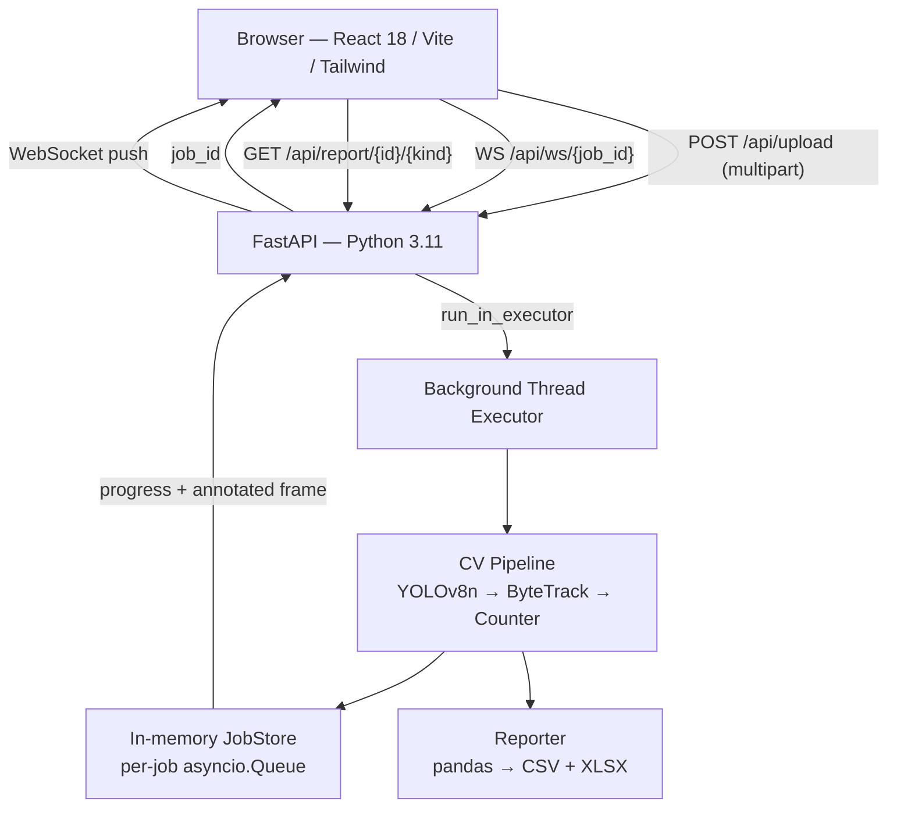

# Smart Drone Traffic Analyzer

A full-stack proof-of-concept that analyses drone video footage frame-by-frame, identifies and tracks vehicles using **YOLOv8 + ByteTrack**, counts unique vehicles passing through the scene while robustly preventing double-counting, and exports the findings as a downloadable **CSV / Excel report** — all via a polished, real-time web UI.

---

## Table of contents

1. [How it works](#how-it-works)
2. [Local setup](#local-setup)
3. [Architecture](#architecture)
4. [CV pipeline — detection & tracking](#cv-pipeline--detection--tracking)
5. [Counting logic — preventing double-counting](#counting-logic--preventing-double-counting)
6. [Edge-case handling](#edge-case-handling)
7. [Report structure](#report-structure)
8. [Testing](#testing)
9. [Engineering assumptions](#engineering-assumptions)
10. [Project layout](#project-layout)

---

## How it works

| Step | What happens |
|------|-------------|
| **1. Upload** | User drags-and-drops an `.mp4` (or `.mov`, `.avi`, `.mkv`). The file is validated by magic-byte check before saving. |
| **2. Processing** | FastAPI schedules the CV pipeline in a background thread executor. Progress and annotated frames stream to the browser over WebSocket in real time. |
| **3. Visualise** | Live `<canvas>` renders every streamed frame: colour-coded bounding boxes, unique tracking IDs, vehicle class labels, and a counting-line overlay. A ring progress indicator shows percentage complete. |
| **4. Report** | On completion the UI shows total vehicles, per-type bar chart, and processing stats. Two download buttons deliver the **CSV** and **Excel** report. |

---

## Local setup

### Prerequisites

| Tool | Version |
|------|---------|
| Python | 3.11 or 3.12 (3.13 also supported — see note below) |
| Node.js | 20.x |
| ffmpeg | optional — broadens codec support for OpenCV |

### Backend

```bash
cd backend
python -m venv .venv

# Windows PowerShell
.venv\Scripts\Activate.ps1
# macOS / Linux
source .venv/bin/activate

pip install -r requirements.txt
copy .env.example .env     # Windows
# cp .env.example .env    # macOS / Linux

uvicorn app.main:app --reload --port 8000
```

> **Python 3.13 + Windows note** — `pip install` pins `numpy>=2.1.0` and `ultralytics>=8.3.128` so the resolver always picks binary wheels and never tries to compile NumPy from source (which would require GCC ≥ 8.4).

On first upload Ultralytics auto-downloads `yolov8n.pt` (~6 MB) into the working directory. Subsequent runs reuse it.

### Frontend

```bash
cd frontend
npm install
copy .env.example .env     # Windows
# cp .env.example .env    # macOS / Linux
npm run dev
```

Open **http://localhost:5173** — Vite proxies `/api/*` and `/api/ws/*` to the backend so no extra CORS setup is needed during development.

### One-command start (Docker Compose)

```bash
docker compose up --build
# Frontend → http://localhost:3000
# API docs → http://localhost:8000/docs
```

### Configuration (backend `.env`)

| Variable | Default | Purpose |
|----------|---------|---------|
| `YOLO_MODEL` | `yolov8n.pt` | Any Ultralytics weight name (`yolov8s.pt` for better accuracy) |
| `YOLO_DEVICE` | `auto` | `auto` / `cpu` / `cuda` / `cuda:0` |
| `YOLO_HALF` | `false` | `true` = FP16 inference (faster on RTX-class GPUs) |
| `FRAME_SKIP` | `2` | Process every Nth frame (1 = every frame) |
| `CONF_THRESHOLD` | `0.35` | YOLO confidence cut-off |
| `TRACK_BUFFER` | `30` | ByteTrack lost-track buffer (frames before ID retirement) |
| `MAX_UPLOAD_BYTES` | `524288000` | 500 MB upload cap |

---

## Architecture



### Design decisions

**Decoupled frontend / backend.** React talks only over HTTP and WebSocket. The FastAPI backend is a standalone Python service with its own process and thread pool.

**No external broker.** FastAPI `BackgroundTasks` + `asyncio.run_in_executor` push CV work to a worker thread while the event loop stays free for network I/O. Each job has its own `asyncio.Queue`; terminal events (`complete`, `error`) are cached so a late-connecting WebSocket client still receives them.

**Thread safety.** The `JobStore` uses a `threading.RLock` for mutable state and a per-job cancel flag (`threading.Event`) that the worker polls every frame — allowing clean mid-run cancellation from the UI without killing the process.

**WebSocket-first with polling fallback.** The `useJobStream` hook opens a WebSocket connection and automatically falls back to polling `GET /api/job/{id}/status` every 2 s if the upgrade fails (e.g. strict proxies), so the UI never shows a blank loading screen.

### Processing flow

1. **Upload & validate** — `POST /api/upload` reads the first 512 bytes to check magic bytes (`filetype` library), streams the body to disk with a size cap, then probes the file with OpenCV to confirm it is decodable before returning `job_id`.
2. **CV pipeline** — `pipeline.py` iterates frames (CLAHE → resize to ≤640 px → YOLO inference → ByteTrack → counter → annotate → JPEG-encode), publishing progress and annotated frames to the job's queue.
3. **Report generation** — on completion `reporter.py` writes the CSV and XLSX and stores the paths on the `JobRecord`.
4. **Cleanup** — a lifespan background coroutine deletes uploads and reports older than 24 h.

---

## CV pipeline — detection & tracking

### Detection

Model: **Ultralytics YOLOv8n** — COCO-pretrained, no fine-tuning required. Inference is restricted to four vehicle classes to skip irrelevant post-processing:

| COCO id | Class |
|---------|-------|
| 2 | car |
| 3 | motorcycle |
| 5 | bus |
| 7 | truck |

CUDA is auto-detected at startup (`YOLO_DEVICE=auto`). The model is loaded once as a process-wide singleton and protected by an `RLock` for thread-safe inference.

**Pre-processing applied to every frame:**
- **CLAHE** (Contrast Limited Adaptive Histogram Equalisation) in LAB colour space — mitigates sun glare and sudden illumination changes that can cause confidence drops.
- **Aspect-preserving resize** to a maximum side of 640 px — halves compute with negligible accuracy loss for vehicle-scale objects.
- **Frame skipping** (default `FRAME_SKIP=2`) — processes every other frame, halving work while keeping sufficient temporal resolution for line-crossing detection.

### Tracking

`supervision.ByteTrack` wraps the ByteTrack algorithm, chosen for:
- working from raw detection boxes only (no appearance embeddings required)
- fast, low-memory operation
- robust ID persistence through short occlusions

Key parameters:

| Parameter | Value | Effect |
|-----------|-------|--------|
| `track_activation_threshold` | 0.25 | Lower than the detection threshold to re-attach tentative tracks |
| `lost_track_buffer` | 30 frames | Keeps an ID alive for ~1 s @ 30 fps through occlusions |
| `minimum_matching_threshold` | 0.8 | Strict IoU matching to prevent ID confusion on dense traffic |
| `minimum_consecutive_frames` | 1 | Track appears on its first detection — no warm-up lag |

The tracker is instantiated **per job** with `frame_rate` set from the source video's actual FPS, so the buffer window is consistent regardless of whether the clip is 24 or 60 fps.

---

## Counting logic — preventing double-counting

A **horizontal virtual line** is drawn at 50% of the frame height. A top-down drone shot means every vehicle that enters the far lane must cross this line exactly once, making it a reliable counting trigger.

### Per-track state machine

```
state = {
    side:    -1  (centroid above line)
              +1  (centroid below line)
               0  (unknown — first observation)
    crossed: False  →  True (latched on first crossing, never reset)
    first_seen, last_seen: frame indices
}
```

A vehicle is counted the **first time its centroid crosses from one side to the other**. The boolean latch is never reset while the track is alive.

### How each edge case is handled

| Scenario | What happens |
|----------|-------------|
| **Vehicle stops on the line** | Centroid stays on the same side — `side` does not change — no increment. |
| **Stop-and-go traffic** | Same as above; a vehicle that decelerates before crossing simply hasn't crossed yet. |
| **Brief occlusion (lamppost, bridge)** | ByteTrack's `lost_track_buffer=30` keeps the same `track_id` alive for up to 1 s. The existing `crossed` latch is reused when the vehicle reappears — no double count. |
| **Oscillation after crossing** | `crossed` is latched `True`; no further increments regardless of how many times the centroid crosses the line. |
| **Long-term occlusion (track expires)** | ByteTrack issues a new `track_id`. The vehicle is counted again when it crosses. This is the only unavoidable double-count scenario; its frequency is controlled by `TRACK_BUFFER` — a larger buffer reduces it at the cost of keeping ghost tracks longer. This trade-off is documented as assumption A7. |
| **Vehicle enters from opposite direction** | Counted on its own crossing — correctly treated as a new event. |
| **Zero vehicles detected** | Job completes normally; `total_vehicles = 0` is surfaced in the UI (not an error state). |

### Annotated live preview

The pipeline draws directly on the resized frame in OpenCV before JPEG-encoding:
- Colour-coded bounding box per class (car = blue, truck = red, bus = purple, motorcycle = green)
- Label: `#<track_id> <class> <confidence>`
- Yellow counting line
- HUD overlay: live per-class counts

Every 5th processed frame (configurable `FRAME_STREAM_EVERY`) is sent over WebSocket and rendered on a `<canvas>` element at the browser for smooth playback.

---

## Edge-case handling

| Situation | Backend | Frontend |
|-----------|---------|----------|
| Non-video file uploaded | `filetype` magic-byte check → HTTP 422 | Toast error message |
| Video file > 500 MB | Streaming size cap → HTTP 413, partial file deleted | Toast error message |
| Corrupt / undecodable video | OpenCV probe → HTTP 422 before job is queued | Toast error message |
| User cancels mid-run | `DELETE /api/job/{id}` sets `cancel_flag` (`threading.Event`); worker checks it every frame | Cancel button in Processing view |
| WebSocket fails / proxy blocks upgrade | n/a | `useJobStream` falls back to 2 s polling automatically |
| Late browser reconnect | Terminal event cached in `JobStore._terminal_events` | Client receives `complete` / `error` immediately on subscribe |
| CPU-only machine | `YOLO_DEVICE=auto` resolves to CPU; FRAME_SKIP reduces load | n/a |

---

## Report structure

Both files are generated automatically on job completion and available via the download buttons.

### CSV (`<job_id>.csv`) — per-frame detections

| Column | Description |
|--------|-------------|
| `frame` | Original frame index in the source video |
| `timestamp` | Seconds from video start |
| `track_id` | ByteTrack-assigned stable vehicle ID |
| `class` | `car` / `truck` / `bus` / `motorcycle` |
| `confidence` | YOLO detection confidence |
| `bbox_x1/y1/x2/y2` | Bounding box in resized-frame coordinates |
| `counted_this_frame` | `True` if this was the crossing frame for this track |

### Excel (`<job_id>.xlsx`) — three sheets

| Sheet | Contents |
|-------|----------|
| **Summary** | Total vehicle count, per-class breakdown, processing duration, video FPS / duration / frame count |
| **Crossings** | One row per counted vehicle: `track_id`, `class_name`, `frame_idx`, `timestamp` |
| **Detections** | Full per-frame log (same as the CSV) |

The **Crossings** sheet is the most useful for auditors — it is the exact set of events that incremented the counter.

---

## Testing

### Backend unit tests

```bash
cd backend
pip install -r requirements.txt -r tests/requirements.txt
pytest -v
```

| Test file | What it covers |
|-----------|---------------|
| `tests/unit/test_counter.py` | 8 cases: single crossing, oscillation after crossing, stop-in-place (no crossing), multi-vehicle independence, occlusion persistence via same ID, long-loss new-ID behaviour, crossings log metadata, unique track ID tracking |
| `tests/unit/test_reporter.py` | CSV column schema, 3-sheet XLSX structure, empty-input edge case |
| `tests/unit/test_device.py` | Device resolution: CPU explicit, CUDA auto-detect, CUDA fallback to CPU when unavailable |
| `tests/integration/test_upload_api.py` | HTTP contract: upload → job_id, invalid file → 422, status endpoint, 409 before complete, 404 for missing report, cancel |

The integration tests stub the YOLO pipeline so they run on any machine without GPU or weights.

### Frontend

```bash
cd frontend
npm install
npm run lint
npm run build   # tsc -b && vite build
```

### CI

`.github/workflows/ci.yml` runs on every push: **ruff** lint + **pytest** for the backend, **ESLint** + **vite build** for the frontend.

---

## Engineering assumptions

| # | Assumption | Rationale |
|---|------------|-----------|
| A1 | Drone footage is roughly top-down and the camera is reasonably stable (no extreme tilt). | A horizontal counting line at 50% frame height is a valid trigger without needing homography or camera calibration. |
| A2 | Only COCO vehicle classes are needed (car, truck, bus, motorcycle). | YOLOv8 is already trained on these — no custom fine-tuning required. |
| A3 | Processing is offline: user uploads a clip; the system processes it and returns results. | The assessment describes exactly this flow. A live-stream worker could be added later by replacing `iter_frames` with a live capture loop. |
| A4 | A single server instance with in-memory job state is sufficient for the PoC. | Eliminates Redis + Celery complexity. The `JobStore` interface is intentionally narrow so a backend swap is mechanical. |
| A5 | Uploads and reports do not need to persist beyond 24 hours. | A lifespan background task prunes stale files, keeping disk usage bounded. |
| A6 | `FRAME_SKIP=2` is an acceptable default speed–accuracy trade-off. | Halves processing time; at typical drone altitudes and traffic speeds, no vehicle crosses the counting line entirely within a single skipped frame. Tunable via env var. |
| A7 | Track double-counting on long-term occlusion is bounded by `TRACK_BUFFER`. | When a track ID is retired and the same physical vehicle re-enters detection, it receives a new ID and is counted again. This is unavoidable without appearance re-ID. The buffer of 30 frames (~1 s) handles the vast majority of real-world occlusions (lampposts, road markings, brief tree cover). |

---

## Project layout

```
smart-drone-analyzer/
├── backend/
│   ├── app/
│   │   ├── api/
│   │   │   ├── routes/
│   │   │   │   ├── upload.py        # POST /api/upload — validate, save, schedule job
│   │   │   │   ├── jobs.py          # GET status, GET result, DELETE cancel
│   │   │   │   └── reports.py       # GET file download (CSV / XLSX)
│   │   │   └── websocket.py         # WS /api/ws/{job_id} — stream progress + frames
│   │   ├── core/
│   │   │   ├── detector.py          # YOLOv8 singleton wrapper, CUDA auto-detect
│   │   │   ├── tracker.py           # supervision.ByteTrack wrapper → Track objects
│   │   │   ├── counter.py           # Virtual-line state machine (double-count prevention)
│   │   │   ├── device.py            # torch device resolution (auto / cuda / cpu)
│   │   │   └── pipeline.py          # Full frame loop: decode → detect → track → count → annotate
│   │   ├── services/
│   │   │   ├── job_store.py         # Thread-safe in-memory job registry + per-job asyncio.Queue
│   │   │   └── reporter.py          # pandas → CSV + 3-sheet XLSX
│   │   ├── utils/
│   │   │   ├── video.py             # Frame iterator, resize, CLAHE, video probe
│   │   │   ├── file_validation.py   # Magic-byte MIME check
│   │   │   └── file_cleanup.py      # 24-hour retention coroutine
│   │   ├── config.py                # pydantic-settings configuration
│   │   ├── schemas.py               # Pydantic models for REST + WebSocket payloads
│   │   └── main.py                  # FastAPI app factory, CORS, lifespan
│   ├── tests/
│   │   ├── unit/                    # test_counter.py, test_reporter.py, test_device.py
│   │   └── integration/             # test_upload_api.py (TestClient, pipeline stubbed)
│   ├── requirements.txt
│   ├── pyproject.toml               # ruff + pytest config
│   ├── Dockerfile
│   └── .env.example
├── frontend/
│   ├── src/
│   │   ├── components/
│   │   │   ├── UploadZone.tsx       # Drag-and-drop, client-side validation, upload progress
│   │   │   ├── ProcessingView.tsx   # Live canvas, ring progress, cancel button
│   │   │   ├── SummaryPanel.tsx     # Stat cards + Recharts bar chart
│   │   │   ├── ReportDownload.tsx   # CSV + XLSX download buttons
│   │   │   └── ToastProvider.tsx    # Context-based toast notifications
│   │   ├── hooks/
│   │   │   ├── useUpload.ts         # XHR upload with progress + abort
│   │   │   └── useJobStream.ts      # WebSocket → polling fallback
│   │   ├── services/api.ts          # Typed fetch + WS URL helpers
│   │   ├── types/index.ts           # Shared TypeScript types
│   │   ├── App.tsx                  # Phase state machine (upload → processing → results → error)
│   │   └── main.tsx
│   ├── package.json
│   ├── vite.config.ts               # Dev proxy for /api/* → backend
│   ├── tailwind.config.ts
│   └── tsconfig.json
├── docker-compose.yml
├── .github/workflows/ci.yml
├── LICENSE
└── README.md
```

---

**FAQs**

1. **Why YOLOv8 and not YOLOv10?**
   YOLOv8 is mature, well-benchmarked on COCO, has first-class Python API support, and is already trained on the four vehicle classes we need. YOLOv10 would also work — it's a config swap.

2. **Why not DeepSORT instead of ByteTrack?**
   DeepSORT requires an appearance-embedding model (extra inference pass). ByteTrack works on bounding boxes alone, is significantly faster, and is more than sufficient for top-down drone footage where vehicles are spatially well-separated.

3. **What happens if the drone camera tilts?**
   The horizontal counting line assumes a roughly vertical viewpoint — documented as assumption A1. For angled cameras, the line would need to be replaced with a perspective-corrected polygon zone. That's a one-function change in `counter.py`.

4. **How does cancellation work?**
   The frontend sends `DELETE /api/job/{id}`. The backend sets a `threading.Event` flag on the job record. The pipeline checks it every frame inside the loop and exits cleanly.

---

## License

MIT — see [LICENSE](LICENSE).
