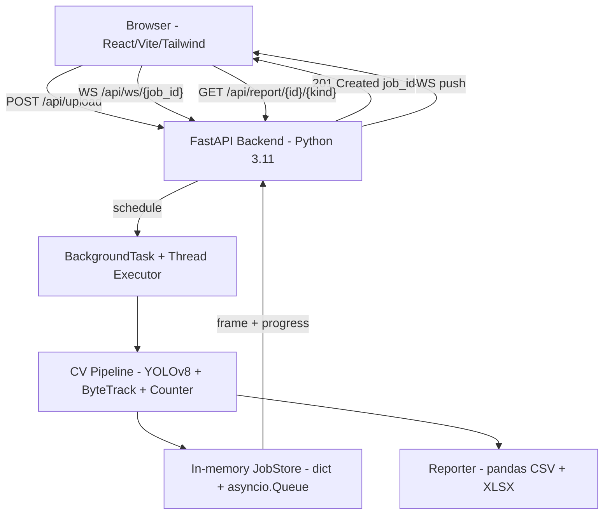

# Smart Drone Traffic Analyzer

A full-stack proof-of-concept that analyses drone-captured traffic footage. Upload an MP4, watch live bounding-boxes appear as the pipeline processes the video, and download a CSV / Excel report containing per-frame detections, line-crossing events, and per-class vehicle counts.

- **Frontend** — React 18 + TypeScript + Vite + Tailwind CSS
- **Backend** — FastAPI (Python 3.11) with WebSocket streaming
- **CV Pipeline** — Ultralytics YOLOv8n + ByteTrack (via `supervision`) + a virtual-line counter
- **Reporting** — pandas → CSV + multi-sheet XLSX

---

## Table of contents

1. [Quick start](#quick-start)
2. [Local development setup](#local-development-setup)
3. [Architecture](#architecture)
4. [Tracking & counting methodology](#tracking--counting-methodology)
5. [Edge-case handling](#edge-case-handling)
6. [API reference](#api-reference)
7. [WebSocket protocol](#websocket-protocol)
8. [Configuration](#configuration)
9. [Testing](#testing)
10. [Engineering assumptions](#engineering-assumptions)
11. [Project layout](#project-layout)
12. [GPU (NVIDIA) & deployment](#gpu-nvidia--deployment)

---

## Quick start

### Option A — Docker Compose (one command)

Requires Docker Desktop with at least 4 GB of memory allocated.

```bash
docker compose up --build
```

- Frontend: <http://localhost:3000>
- Backend OpenAPI docs: <http://localhost:8000/docs>

The backend image pre-downloads `yolov8n.pt` during build. Uploads and reports are persisted in a named volume (`drone-data`).

### Option B — Local processes

In one terminal (backend):

```bash
cd backend
python -m venv .venv
# Windows PowerShell:
. .venv/Scripts/Activate.ps1
# macOS / Linux:
# source .venv/bin/activate
pip install -r requirements.txt
copy .env.example .env   # or `cp` on macOS/Linux
uvicorn app.main:app --reload --port 8000
```

In another terminal (frontend):

```bash
cd frontend
npm install
copy .env.example .env   # or `cp` on macOS/Linux
npm run dev
```

Open <http://localhost:5173>. The Vite dev server proxies `/api/*` and `/api/ws/*` to <http://localhost:8000>, so no CORS configuration is necessary in development.

---

## Local development setup

### Prerequisites

| Tool | Version |
|------|---------|
| Python | 3.11 (works on 3.12 / 3.13 too) |
| Node.js | 20.x |
| ffmpeg | optional — improves OpenCV codec support |
| (optional) NVIDIA GPU + CUDA | dramatically faster YOLO inference |

### GPU (NVIDIA) & deployment

- **Using an RTX 4060 Ti (or any CUDA GPU) in development:** the pipeline uses the GPU when `YOLO_DEVICE=auto` (default) **and** PyTorch was installed **with CUDA** (`torch.cuda.is_available()` must be `True`). The stock `pip install -r requirements.txt` often installs a **CPU-only** Torch build — see **[docs/DEPLOYMENT.md](docs/DEPLOYMENT.md)** for the exact PyTorch install command and verification one-liner. Set `YOLO_HALF=true` in `backend/.env` for faster FP16 inference on RTX.
- **Deploying the full stack:** step-by-step options (Docker Compose, bare metal, HTTPS/WebSockets, optional GPU in Docker) are in **[docs/DEPLOYMENT.md](docs/DEPLOYMENT.md)**.

### First-run notes

- The first call to `/api/upload` triggers Ultralytics to download `yolov8n.pt` (~6 MB) into the backend working directory. Subsequent runs reuse it.
- Set `YOLO_MODEL=yolov8s.pt` in `backend/.env` to trade speed for accuracy. Any Ultralytics weight name works.
- Drop a sample drone clip into the UI to verify everything is wired correctly.

### Troubleshooting: NumPy build error on Windows + Python 3.13

If `pip install -r requirements.txt` fails with **“NumPy requires GCC >= 8.4”**, pip was trying to **compile NumPy 1.26** from source (no Windows wheel for Python 3.13). Older `ultralytics==8.3.0` also pulled `numpy<2`, which triggered that backtrack. This repo pins **`numpy>=2.1.0`** and **`ultralytics>=8.3.128`** so the resolver stays on **binary wheels only**. Upgrade your checkout and run `pip install -U pip` then `pip install -r requirements.txt` again.

---

## Architecture



### Why this shape

- **Decoupled frontend / backend.** The React app communicates only over HTTP + WebSocket — easy to swap one for the other later (a desktop wrapper, a mobile client, etc.).
- **No external broker.** A PoC does not need Celery + Redis. We use FastAPI `BackgroundTasks` and `asyncio.run_in_executor` to push CV work to a worker thread while keeping the event loop free for HTTP/WebSocket traffic.
- **Job store with cached terminal events.** Each job has its own `asyncio.Queue`. On `complete`/`error` the message is also cached, so a client connecting *after* completion still receives the result on its first read.
- **WebSocket-first with polling fallback.** The `useJobStream` hook tries WebSocket and falls back to polling `GET /api/job/{id}/status` if the upgrade fails.

### Process flow

1. **Upload** — `POST /api/upload` validates the MIME / magic bytes (`filetype` library) and a streaming size check (max 500 MB), saves the file to `backend/data/uploads/<uuid>.mp4`, and probes it with OpenCV to confirm it is decodable.
2. **Job creation** — A `JobRecord` is registered in the in-memory `JobStore`. A background task is scheduled.
3. **Processing** — `app.core.pipeline.run_pipeline` runs in a thread executor: decode → CLAHE → resize → YOLOv8 → ByteTrack → counter → annotate → JPEG-encode → publish to the job queue.
4. **Live preview** — Every Nth processed frame (default 5) is JPEG-encoded (q=65), base64-wrapped, and streamed to the WebSocket client. Progress ticks are throttled to ~4 Hz.
5. **Reporting** — On completion `app.services.reporter.generate_reports` writes `<job_id>.csv` and `<job_id>.xlsx` (Summary + Crossings + Detections sheets) under `backend/data/reports/`.
6. **Cleanup** — A background task in the FastAPI lifespan deletes uploads and reports older than `FILE_RETENTION_HOURS` (default 24).

---

## Tracking & counting methodology

### Detection

Ultralytics YOLOv8n filtered to the COCO vehicle classes:

| Class id | Class name |
|----------|------------|
| 2 | car |
| 3 | motorcycle |
| 5 | bus |
| 7 | truck |

Inference is restricted with `classes=[...]` to skip pedestrian / animal post-processing entirely. CUDA is auto-detected at startup.

### Tracking

`supervision.ByteTrack` wraps the ByteTrack algorithm. Configured with:

- `track_activation_threshold = 0.25`
- `lost_track_buffer = 30` (≈ 1 s @ 30 fps; survives short occlusions)
- `minimum_matching_threshold = 0.8`
- `minimum_consecutive_frames = 1` (so we never lose the first observation)

The tracker is constructed *per job* with `frame_rate` set to the source video's actual FPS, which makes the buffer behave consistently across clips of different framerates.

### Counting (preventing double counts)

A horizontal **virtual line** is placed at `0.5 × frame_height`. Each track maintains a small state machine:

```
{
  side:     -1 above the line, +1 below, 0 unknown,
  crossed:  bool — latched to True on first transition,
  first_seen, last_seen,
}
```

Behaviour:

- **First crossing** — `side` flips → counter increments → `crossed = True`.
- **Subsequent oscillations** — `crossed` is latched, no further increments even if the track wobbles back and forth on the line.
- **Stop-and-go traffic** — `side` does not change, so no extra increments.
- **Brief occlusion (lamppost, bridge)** — ByteTrack preserves the same `track_id` for up to `track_buffer` frames; the latched state is reused → no double count.
- **Long-term loss** — a brand-new `track_id` is issued, which is the only condition where double-counting could occur. The trade-off knob is `TRACK_BUFFER` (env var); larger values reduce double-counting but also retain ghosts longer.

The `crossings` log records the exact `(track_id, class_name, frame_idx, timestamp)` of every counted crossing — the report's most useful audit trail.

### Pre-processing

- **Resize.** Frames are downscaled so the longest side ≤ 640 px (preserving aspect). Reduces inference time without measurable accuracy loss for vehicles, which dominate the frame.
- **Frame skipping.** `FRAME_SKIP=2` (default) processes every other frame. Halves compute while keeping enough temporal resolution for crossing detection. Configurable via env var.
- **CLAHE.** Per-frame contrast equalisation in LAB space mitigates sun glare and illumination jumps that can otherwise cause confidence drops.

---

## Edge-case handling

| Situation | How it is handled |
|-----------|-------------------|
| Non-video upload (e.g. PDF renamed `.mp4`) | `filetype` magic-byte check rejects with HTTP 422 |
| Oversized upload (> 500 MB) | Streaming size check aborts with HTTP 413 and deletes the partial file |
| Corrupt or zero-length video | OpenCV `probe_video` rejects with HTTP 422 before queuing the job |
| Zero vehicles in scene | Job completes normally with `total_vehicles = 0` (a valid result, not an error) |
| Vehicle stops on the line | Side does not change — no extra increment |
| Vehicle passes behind occlusion | ByteTrack `lost_track_buffer = 30` keeps the ID alive |
| Vehicle exits then re-enters from the opposite side | New track id is issued — counted again only after a fresh crossing |
| Sun glare / sudden brightness | CLAHE pre-processing stabilises detector confidence |
| User cancels mid-run | `DELETE /api/job/{id}` flips a thread-safe flag the worker checks per frame |
| WebSocket fails (proxy strips upgrade) | `useJobStream` automatically polls `GET /api/job/{id}/status` every 2 s |
| Late client connection | `JobStore` caches the terminal event, so a late subscriber still receives it |
| CPU-only host | Pipeline transparently falls back to CPU; lower the model size / raise `FRAME_SKIP` for acceptable runtime |

---

## API reference

| Method | Path | Description |
|--------|------|-------------|
| GET | `/api/health` | Liveness probe |
| POST | `/api/upload` | `multipart/form-data` with field `file`. Returns `{ job_id, filename, size_bytes }` |
| GET | `/api/job/{id}/status` | `{ job_id, status, pct, message }` — `status ∈ {pending, processing, completed, failed, cancelled}` |
| GET | `/api/job/{id}/result` | Full summary + report URLs (HTTP 409 if not yet complete) |
| DELETE | `/api/job/{id}` | Cancel an in-flight job and delete its source video |
| GET | `/api/report/{id}/csv` | Per-frame detections as CSV |
| GET | `/api/report/{id}/xlsx` | Multi-sheet workbook (Summary, Crossings, Detections) |
| WS | `/api/ws/{id}` | Live progress + annotated-frame stream |

Full interactive docs: <http://localhost:8000/docs>.

---

## WebSocket protocol

```jsonc
// progress tick (~4 Hz)
{ "type": "progress", "pct": 42.5, "processed": 200, "total": 470 }

// annotated frame (every Nth processed frame, base64 JPEG)
{ "type": "frame", "frame_idx": 314, "data": "<base64 JPEG q=65>" }

// terminal events
{ "type": "complete",
  "summary": { "total_vehicles": 27, "by_type": {...}, "processing_seconds": 42.1, ... },
  "report_csv_url": "/api/report/<id>/csv",
  "report_xlsx_url": "/api/report/<id>/xlsx" }

{ "type": "error", "message": "Unable to decode frame 122" }
```

The server emits a heartbeat `progress` event every 30 s while a job is in flight to prevent idle-disconnect from upstream proxies.

---

## Configuration

All backend settings live in `backend/.env` (see `.env.example`):

| Variable | Default | Purpose |
|----------|---------|---------|
| `HOST` / `PORT` | `0.0.0.0` / `8000` | uvicorn bind |
| `CORS_ORIGINS` | `http://localhost:5173,http://localhost:3000` | Comma-separated CORS allowlist |
| `DATA_DIR` / `UPLOAD_DIR` / `REPORT_DIR` | `./data...` | On-disk storage roots |
| `MAX_UPLOAD_BYTES` | `524288000` (500 MB) | Streaming upload cap |
| `YOLO_MODEL` | `yolov8n.pt` | Any Ultralytics weight name |
| `YOLO_DEVICE` | `auto` | `auto` / `cpu` / `cuda` / `cuda:0` — GPU only if PyTorch+CUDA is installed |
| `YOLO_HALF` | `false` | `true` = FP16 on CUDA (faster on RTX) |
| `FRAME_SKIP` | `2` | Process every Nth original frame |
| `RESIZE_MAX` | `640` | Longest-side resize before inference |
| `CONF_THRESHOLD` | `0.35` | Detector confidence cut-off |
| `TRACK_BUFFER` | `30` | ByteTrack lost-track buffer (frames) |
| `FRAME_STREAM_EVERY` | `5` | Send 1 of every N processed frames over WS |
| `FILE_RETENTION_HOURS` | `24` | Auto-cleanup window |

Frontend (`frontend/.env`):

| Variable | Default | Purpose |
|----------|---------|---------|
| `VITE_API_URL` | _(empty — same origin)_ | Override backend base URL when frontend & backend are deployed separately |

---

## Testing

### Backend

```bash
cd backend
pip install -r requirements.txt -r tests/requirements.txt
pytest -v
```

- **Unit** — `tests/unit/test_counter.py` (counting state machine: stop-and-go, occlusion, double-count prevention, multi-vehicle), `tests/unit/test_reporter.py` (CSV/XLSX schema + sheet structure)
- **Integration** — `tests/integration/test_upload_api.py` (end-to-end against a `TestClient`; the YOLO pipeline is stubbed so CI does not need GPUs / weights)

### Frontend

```bash
cd frontend
npm install
npm run lint
npm run build
```

### Continuous integration

`.github/workflows/ci.yml` runs ruff + pytest for the backend and ESLint + `vite build` for the frontend on every push and pull request.

---

## Engineering assumptions

| # | Assumption | Rationale |
|---|------------|-----------|
| A1 | Drone is roughly top-down and the camera is reasonably stable. | A horizontal counting line at 50% frame height is a sound first-cut without requiring homography. |
| A2 | Only COCO vehicle classes (car, truck, bus, motorcycle) are needed. | YOLOv8 is already trained on these — no fine-tuning required for the brief. |
| A3 | Processing is offline (upload → process → report). | The brief explicitly describes this flow. The architecture would still admit a `live=True` streaming worker. |
| A4 | A single backend instance is sufficient for the PoC. | An in-memory `JobStore` is the simplest correct choice. The architecture is structured so swapping in Redis + Celery later is mechanical. |
| A5 | Files do not need to be retained beyond 24 hours. | A periodic cleanup task removes stale uploads and reports — keeps disk usage bounded and minimises privacy exposure. |
| A6 | `FRAME_SKIP=2` is an acceptable default. | Halves processing time, with negligible impact on the line-crossing metric for typical traffic speeds. Tunable per deployment. |
| A7 | Track double-counting is bounded by `TRACK_BUFFER`. | When `TRACK_BUFFER` is exceeded the same vehicle gets a new id; this is documented and tested explicitly. |

---

## Project layout

```
.
├── backend/
│   ├── app/
│   │   ├── api/
│   │   │   ├── routes/    # upload.py, jobs.py, reports.py
│   │   │   └── websocket.py
│   │   ├── core/          # detector.py, tracker.py, counter.py, pipeline.py
│   │   ├── services/      # job_store.py, reporter.py
│   │   ├── utils/         # video.py, file_validation.py, file_cleanup.py
│   │   ├── config.py
│   │   ├── schemas.py
│   │   └── main.py
│   ├── tests/
│   │   ├── unit/          # test_counter.py, test_reporter.py
│   │   └── integration/   # test_upload_api.py
│   ├── Dockerfile
│   ├── pyproject.toml
│   ├── requirements.txt
│   └── .env.example
├── frontend/
│   ├── src/
│   │   ├── components/    # UploadZone, ProcessingView, SummaryPanel, ReportDownload, ToastStack
│   │   ├── hooks/         # useUpload, useJobStream, useToasts
│   │   ├── services/      # api.ts (typed REST + WS helpers)
│   │   ├── types/
│   │   ├── App.tsx
│   │   ├── index.css
│   │   └── main.tsx
│   ├── Dockerfile
│   ├── nginx.conf
│   ├── package.json
│   ├── tailwind.config.ts
│   ├── vite.config.ts
│   └── tsconfig.json
├── docker-compose.yml
├── .github/workflows/ci.yml
└── README.md
```

---

## License

MIT — see [LICENSE](LICENSE).
